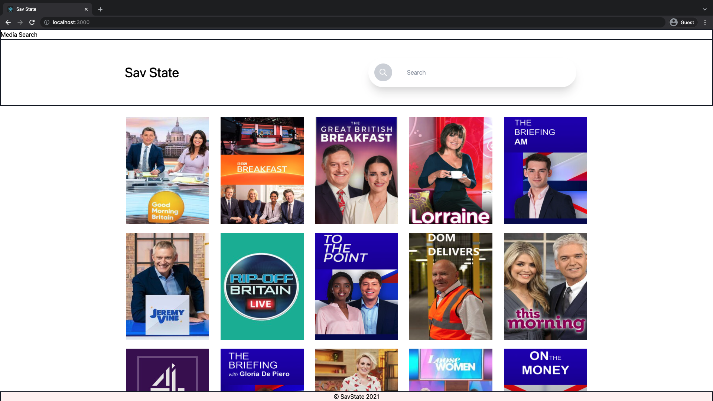
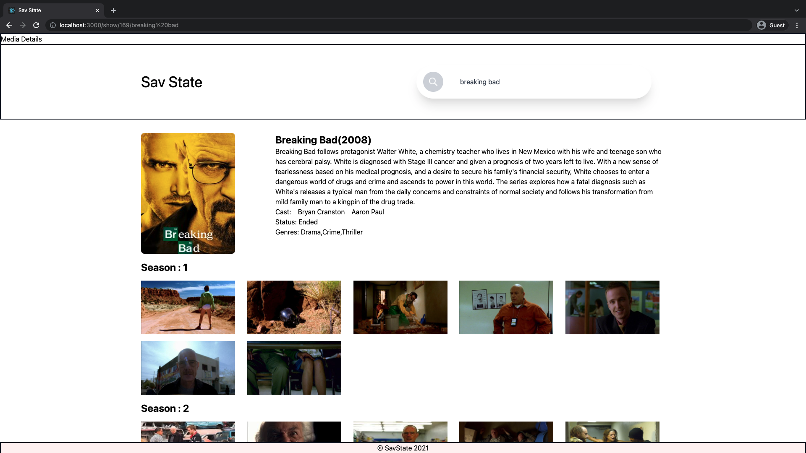

# To Start the project 
## Available Scripts

In the project directory, you can run:

### `yarn start`

Runs the app in the development mode.\
Open [http://localhost:3000](http://localhost:3000) to view it in the browser.

# About this project 
This project is build by React, TypeScript and Tailwind CSS.

Application is connected with TVMaze API

In the home page, App will display UK current shows and search box. 

After input search query , page will reload and search with the same query. 

And navigated with updates URL, if you reload the page it will load the same movie. 

